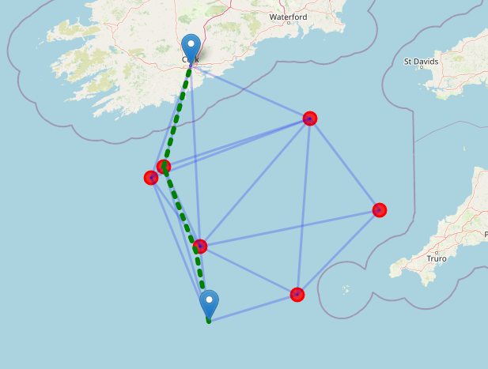

# Satellite Communication Network Simulation

This project simulates P2P communication of satellites, ships, and ground control stations communicating with each other. It demonstrates concepts of distributed systems, network routing, and secure communication.

### Important notes:
- Project runs on localhost by default 
- To run on Raspberry Pis, our please set EARTH_IP and SATELLITES_IP in `src/config.py`. 
- Ground control and Ship will be run on one Pi while the satellite will run on the second Pi.
- Please be sure to run `visualise.py` (step 5). Our implementation relies on the visual more than logs to depict what is happening.

- Please run commands in separate terminal windows to see logs. Run all commands from the root directory of the project.

## Project Overview

The simulation consists of:

- **Ships**: Mobile vessels that generate telemetry data and send it to ground control via satellites
- **Satellites**: Orbital nodes that relay messages between ships and ground control
- **Ground Control**: Central station that receives and processes ship telemetry data
- **Visualization**: Web interface to visualize the network topology and message routing

The system implements:
- Secure communication with symmetric encryption
- Data integrity verification with checksums
- Dynamic routing based on network topology
- Resilience to node failures
- Visualization of network state and message routing

## Visualization

The system includes a real-time visualization web interface that shows the positions and communications between ships, satellites, and ground control.



In the visualization:
- Red circles represent satellites
- Blue marker in the sea represents the ship
- Blue marker on land represents ground control
- **Blue lines** show potential communication paths between entities within range of each other
- **Green dashed lines** show active message transmissions happening in real-time

This visualization allows you to observe the dynamic routing of messages as they travel from ships through the satellite network to ground control. When satellites move out of range or are disabled, you can watch the system adapt by finding new communication paths.

## Installation

### Prerequisites

- Python 3.6+
- pip package manager

### Setup

1. Clone the repository:
```bash
git clone <repository-url>
cd sc_project3
```

2. (Optional) Create and activate a Python virtual environment:
```bash
python3 -m venv .venv
source .venv/bin/activate
```

3. Install dependencies:
```bash
pip3 install -r requirements.txt
```

## Running the Simulation

Run each component in a separate terminal window from the project root directory:

### 1. Start Ground Control

```bash
./run_ground_control.sh
```

### 2. Launch Satellites

```bash
./run_satellites.sh
```

### 3. Start Ship

```bash
./run_ship.sh
```

### 4. Launch Visualization

```bash
python3 src/visualise.py
```

Access the visualization at http://127.0.0.1:33069

## Configuration

The system can be configured by modifying parameters in `src/config.py`:

- Network addresses and ports
- Communication range
- Movement parameters
- Simulation settings

## Testing Resilience

To test the system's resilience to satellite failures:

1. Identify a satellite's port by clicking on it in the visualization
2. Stop the satellite:
```bash
./stop_port.sh <port>
```
3. Observe how messages are rerouted through other available satellites

## Stopping the Simulation

To stop all satellites and free up ports:
```bash
./stop_satellites.sh
```

For other components, use Ctrl+C in their respective terminal windows.

## Deployment on Raspberry Pi

To run on Raspberry Pi devices:

1. Update `SATELLITE_IP` and `EARTH_DEVICE_IP` in `src/config.py` with the appropriate IP addresses
2. Run ground control and ship on one Pi, satellites on another
3. Configure port forwarding if needed to access the visualization

## License

[Specify license information here]

## Contributors

[List contributors here]
